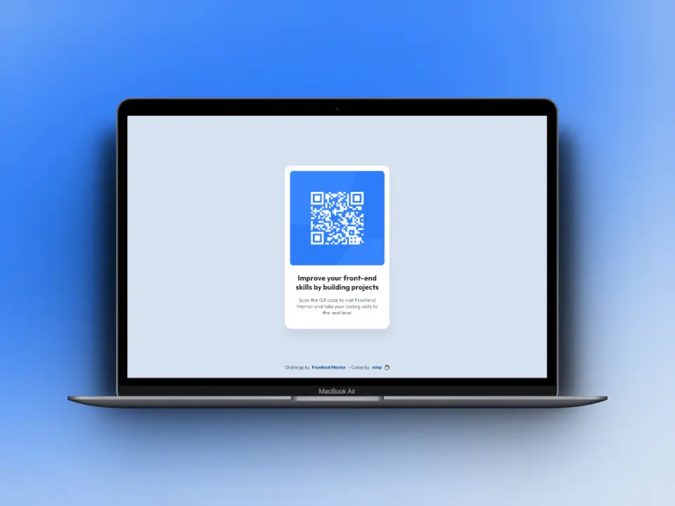

# Frontend Mentor - QR code component solution

This is a solution to the [QR code component challenge on Frontend Mentor](https://www.frontendmentor.io/challenges/qr-code-component-iux_sIO_H). 

Frontend Mentor challenges help you improve your coding skills by building realistic projects. 

## Table of contents

- [Screenshots](#screenshots)
- [Links](#links)
- [Built with](#built-with)
- [Author](#author)

## Screenshots

### 📱 Mobile

### 💻 Desktop

## Links

[Live Site](https://mendez-v.github.io/qr-code-component-main/) 👀

[Solution in Frontend Mentor](https://www.frontendmentor.io/solutions/qr-code-component-SzgP2eZz8B) 👀

[Challenge repository](https://github.com/mendez-v/frontend-mentor-challenges) 👀

## Built with

✅ Semantic HTML5 markup  

✅ CSS custom properties  

✅ CSS Grid  

✅ Mobile-first workflow

## Author

✨ Frontend Mentor - [@mendez-v](https://www.frontendmentor.io/profile/mendez-v)
